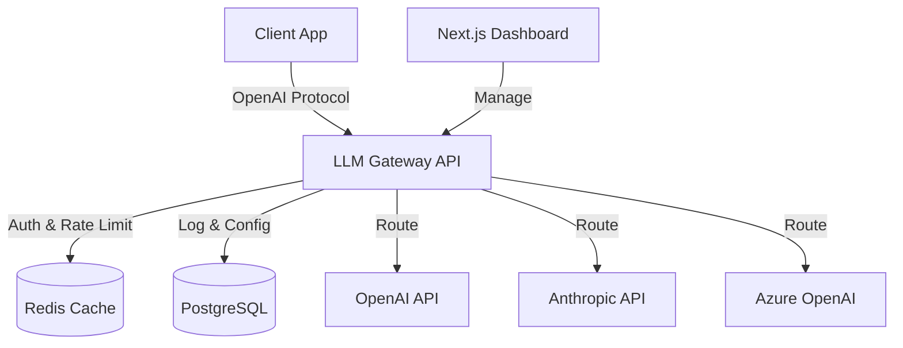

# LLM Gateway

<div align="center">


[](https://opensource.org/licenses/MIT)
[](https://www.docker.com/)
[](https://www.typescriptlang.org/)
[](https://nextjs.org/)
[](https://www.postgresql.org/)

**An enterprise-grade, unified API gateway for managing, routing, and monitoring Large Language Model (LLM) traffic.**

[Features](#key-features) • [Getting Started](#getting-started) • [Architecture](#architecture) • [API Reference](#api-reference) • [Contributing](#contributing)

</div>

---

## 🚀 Overview

LLM Gateway is a self-hosted intermediary service that sits between your applications and AI providers (like OpenAI, Anthropic, Azure, and more). It provides a **unified, OpenAI-compatible API** interface while adding critical enterprise capabilities like load balancing, caching, rate limiting, and detailed observability.

Stop managing scattered API keys and complex routing logic in your client apps. Centralize your AI infrastructure with LLM Gateway.

## ✨ Key Features

*   **🔌 Unified Interface**: Drop-in replacement for the OpenAI SDK. Switch providers without changing client code.
*   **⚖️ Smart Routing**:
    *   **Load Balancing**: Distribute traffic across multiple API keys or accounts.
    *   **Failover**: Automatically switch to backup providers if primary fails.
    *   **Priority Routing**: Route specific teams or tasks to specific models.
*   **⚡ High Performance**:
    *   **Caching**: Built-in Redis caching for identical requests to save costs and reduce latency.
    *   **Streaming**: Full support for Server-Sent Events (SSE) streaming.
*   **🛡️ Reliability & Security**:
    *   **Rate Limiting**: Granular rate limits per API key or Team.
    *   **Multi-Tenancy**: Organize users into Teams and Projects with isolated quotas.
    *   **Secure Storage**: AES-256 encryption for stored provider API keys.
*   **📊 Observability**:
    *   **Dashboard**: Modern Next.js UI for real-time monitoring.
    *   **Metrics**: Detailed usage logs, token counts, and latency tracking.
    *   **Cost Tracking**: Monitor spend across different providers.

## 🛠️ Tech Stack

*   **Backend**: Node.js (Express), TypeScript
*   **Frontend**: Next.js, React, Tailwind CSS (E2B-style dark mode)
*   **Database**: PostgreSQL (Persistent storage)
*   **Cache/Queue**: Redis (Caching & Rate limiting)
*   **Infrastructure**: Docker & Docker Compose

## 🚀 Getting Started

### Prerequisites

*   Docker & Docker Compose
*   Node.js 18+ (for local development)

### Quick Start (Docker)

1.  **Clone the repository**
    ```bash
    git clone https://github.com/furqanahmadrao/LLM-Gateway.git
    cd LLM-Gateway
    ```

2.  **Configure Environment**
    Copy the example environment file:
    ```bash
    cp .env.example .env
    ```
    *Edit `.env` and provide your database credentials and encryption key.*

3.  **Run with Docker Compose**
    ```bash
    docker-compose -f docker-compose.yml -f docker-compose.ui.yml up -d --build
    ```

4.  **Access the Dashboard**
    *   **UI**: http://localhost:3001
    *   **API**: http://localhost:3000

### Configuration

1.  Open the Dashboard (`http://localhost:3001`).
2.  Navigate to **Providers** and add your first provider (e.g., OpenAI).
3.  Go to **API Keys** and generate a new key for your application.

## 📡 API Usage

The gateway implements the OpenAI API specification. You can use the standard OpenAI libraries.

### Python Example

```python
from openai import OpenAI

client = OpenAI(
    base_url="http://localhost:3000/v1",
    api_key="gateway-sk-..." # Your LLM Gateway API Key
)

completion = client.chat.completions.create(
  model="openai:gpt-4", # Format: provider:model
  messages=[
    {"role": "user", "content": "Hello world!"}
  ]
)

print(completion.choices[0].message.content)
```

### Curl Example

```bash
curl http://localhost:3000/v1/chat/completions \
  -H "Content-Type: application/json" \
  -H "Authorization: Bearer gateway-sk-..." \
  -d '{
    "model": "openai:gpt-3.5-turbo",
    "messages": [{"role": "user", "content": "Say hello!"}]
  }'
```

## 🏗️ Architecture



## 🤝 Contributing

Contributions are welcome! Please read our [Contributing Guide](CONTRIBUTING.md) for details on our code of conduct, and the process for submitting pull requests.

## 📄 License

This project is licensed under the MIT License - see the [LICENSE](LICENSE) file for details.
